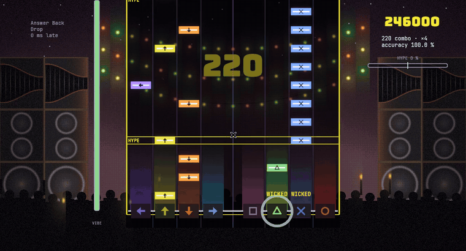
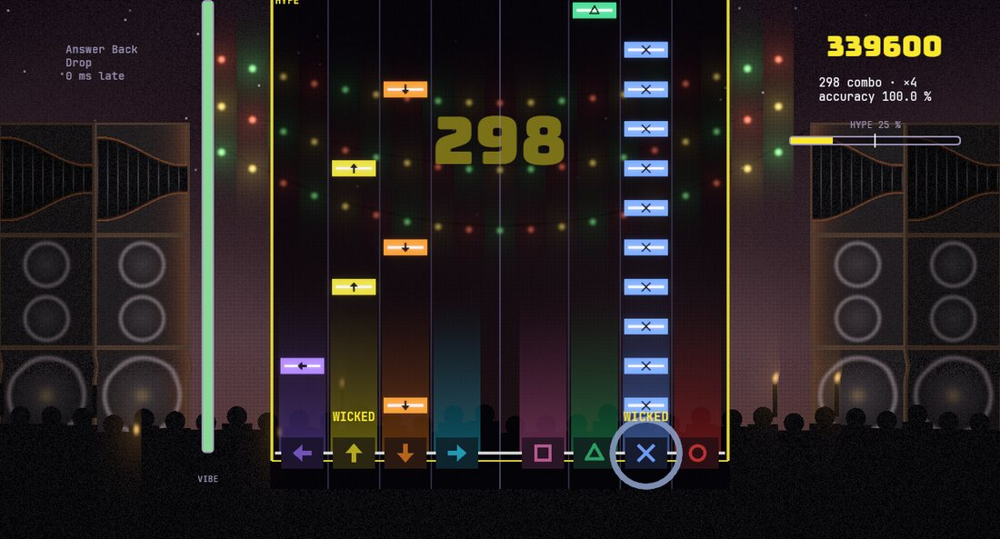
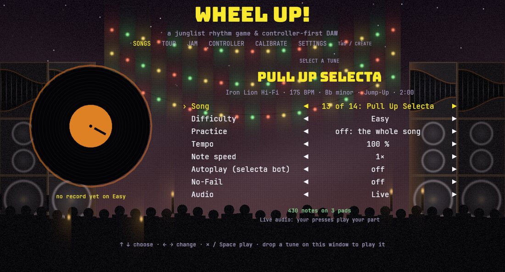
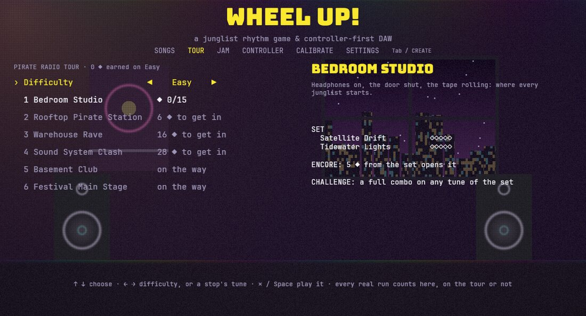
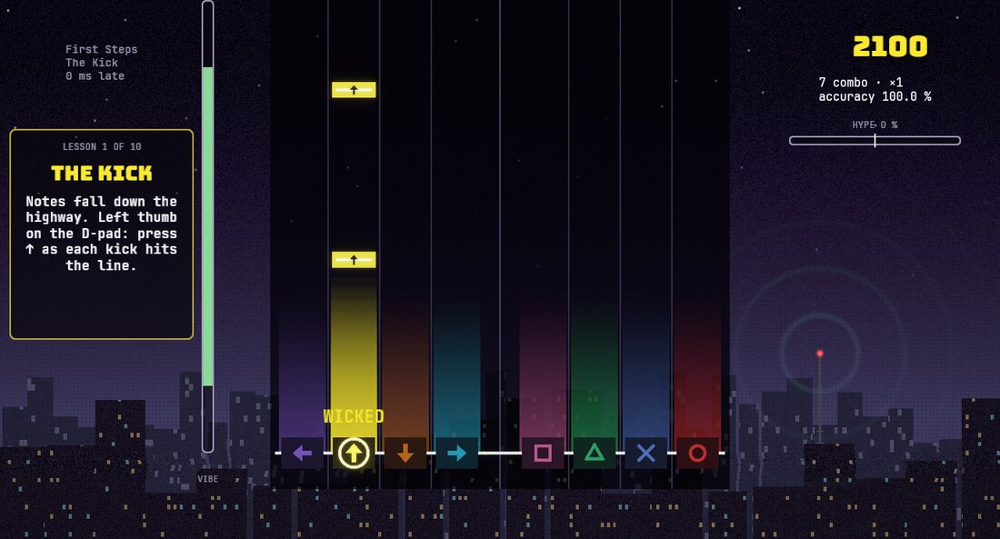

<p align="center">
  
</p>

<h1 align="center">WHEEL UP!</h1>

<p align="center">
  <b>Play the drums of drum &amp; bass on a PlayStation controller.</b><br>
  A junglist rhythm game in Rust: twelve original tunes, a tour from a bedroom studio to a
  festival's main stage, and any jungle MP3 you drop on the window turned into a level.
</p>

<p align="center">
  <a href="https://github.com/Zeyrin/dnb/releases/latest"><b>Download for Windows, macOS and Linux</b></a>
  · <a href="#play">Play</a> · <a href="#how-its-made">How it's made</a>
</p>

## What it plays like

- **Your controller is a drum kit.** The D-pad and the face buttons are eight pads: kick,
  snare, ghost, rim, jungle snare, tom, closed and open hat. L1 and R1 take the rolls. Click
  both sticks for a **WHEEL UP!**: the tune spins back like a DJ's rewind, and you play it
  again for double points.
- **Always the kick and the snare.** Every level, Beginner to Junglist, plays every kick and
  every snare; the difficulty only adds the rest of the kit around them.
- **Your tunes, on their own drums.** Drop an MP3 on the window: the game finds the tempo
  and the downbeat, hears the kicks, snares, ghosts and hats, the drops, and the groove (how
  late each drum sits against the grid), then makes a level where every note lands on a
  real hit.
- **Twelve original tunes**, ragga to neuro, darkside to liquid: every sound, the breaks
  included, synthesised from code, then mixed and mastered by the game's own engine.
- **The Pirate Radio Tour**: from a bedroom studio to a festival's main stage, each stop
  with its set, its encore, its challenge and its own scene.
- **Tight, fair timing**: a ±25 ms window for a WICKED on Hard, your speakers' and screen's
  latency calibrated away, and a warm-up so nobody fails in the first bars.
- **Easy to get into**: a guided first song, practice loops at 50–150 % speed, No-Fail, a
  selecta bot that plays it for you, in English or French.

| | |
|---|---|
|  |  |
|  |  |

## Play

[Download the latest release](https://github.com/Zeyrin/dnb/releases/latest), unzip it and
run `wheelup` (`wheelup.exe` on Windows). On macOS the game isn't signed: the first time,
right-click it and choose **Open**. On Linux it needs ALSA and udev, which desktops have.

Plug in a controller (DualSense, DualShock 4, Xbox, Switch Pro…); the keyboard works too,
its timing only as fine as the frame rate. Play on wired headphones or speakers if you can:
on Bluetooth or a TV the sound comes too late to play the part live, so set **Audio** to
**Classic** on the song screen. Calibrate once per audio output: the **Calibrate** screen
measures how late you tap after the sound and after the picture, and saves both.

To play your own tunes, drop them on the window: MP3, WAV, FLAC, OGG or M4A, lossless if
you have it. Got the tune's drum stem? Put it beside the tune as `Tune.drums.wav` (or
`Tune (drums).flac`…): the game hears the beat and the drums on it, where no bass can pass
for a kick, and still plays the whole tune.

### Controls

| Controller | Keyboard | Does |
|---|---|---|
| D-pad ↑ ↓ ← → | ↑ ↓ ← → | pads: kick, snare, ghost, rim (Reel layout) |
| △ □ ✕ ○ | I J K L | pads: jungle snare, low tom, closed hat, open hat |
| L1 / R1 | E / O | roll strokes: inside a roll band, the roll's pad (left hand L1, right R1) |
| L2 / R2 | Z / N | the bass, if OPTIONS → Bass on the triggers is on: hold for as long as the note lasts (analog on a controller) |
| OPTIONS | Space / Enter | play / stop the jam groove; pause a song |
| CREATE | Tab | next screen: Songs, Tour, Jam, Controller, Calibrate, Settings; quit a song |
| ✕ / ○ | K / L | in menus: confirm / back |
| L3 + R3 | X + M | WHEEL UP!: pull the tune back once the hype meter is half full |
| L3 (Controller screen) | X | swap layout: Reel ↔ Drummer (kick on ↓) |
| | R | back to the start |
| | F12 | screenshot to `screenshots/` |
| | Esc | menu: resume, restart, leave the song, quit |

**Songs** is the rhythm game: pick a tune, a difficulty (Beginner to Junglist), a section
to practise (it loops until you leave, each pass's accuracy shown), a tempo (50–150 %),
autoplay (the "selecta bot" plays it for you) and No-Fail, then play along on the highway. New to it? **First Steps**, at the top of the list (and picked for
you until you set a record), teaches every control in turn on a real jungle tune: the
kick, the snare, the two-step, the hats, the ghosts, rolls, hype phrases
and WHEEL UP!. **Tour** is the Pirate Radio Tour: stops from a bedroom studio to a festival's main
stage, each with a set, an encore and a challenge, opened by the stars your records
earn. **Jam** is free play over the demo groove. **Settings** holds the language (English
or French, the system's until you pick one), the controller layout, note speed, the audio
mode, the WHEEL UP! flare and motion.

## Build from source

Rust: `rust-toolchain.toml` pins the version; rustup installs it on first build. On Linux,
install the audio, input and windowing headers first:

```sh
sudo apt-get install libasound2-dev libudev-dev libwayland-dev libxkbcommon-dev
```

Then, from this folder:

```sh
cargo run --release -p wheelup       # the game (first build takes a while: Bevy)
cargo run -p wheelup -- --autoplay   # the selecta bot plays the songs you start
cargo run -p wheelup -- --buffer 128 # ask the sound card for a smaller buffer
cargo run -p wheelup -- --silent     # no sound card: the engine runs silently
```

A tag like `v0.1.0` builds the game for Windows, macOS and Linux and publishes it as a
release ([`.github/workflows/release.yml`](.github/workflows/release.yml)).

## How it's made

- **An audio engine of its own**, fed through lock-free ring buffers: drums, basses, pads and
  breaks synthesised, then mixed with reverb, dub delay, sidechain and a limiter, every song
  mastered to −16 LUFS. No sample in the game comes from anywhere else.
- **Input on its own thread**, stamped on the same monotonic clock as the audio: a hit is
  judged where it was played, not where a frame happened to catch it.
- **An auto-charter** cuts each song's drums into five levels under playability rules
  (spacing for each thumb, chords, density, rolls), and a validator checks every chart in
  the tests.
- **The importer** decodes the MP3, follows each frequency band's attacks, fits the tempo
  and refines it over the whole tune, hears the drums with a logistic model per drum, tracks
  the bass, and measures each drum's micro-timing.
- About 31,000 lines of Rust in 11 crates and 279 tests; CI runs rustfmt, clippy and the
  tests on Linux, Windows and macOS.

| Crate | What it is |
|---|---|
| `crates/wu-time` | ticks (960 per beat), tempo maps, swing, the shared monotonic clock |
| `crates/wu-dsp` | oscillators, filters, envelopes, noise, saturation, reverb, dub delay, the "Sampler Era" crusher |
| `crates/wu-instruments` | drum synthesis, breaks performed and sampled, kits, synth patches and voices, FX (no third-party audio) |
| `crates/wu-audio` | the engine: sequencer, voices, clock, offline/null/sound-card outputs |
| `crates/wu-input` | controllers on their own thread, layouts, trigger thresholds, statistics |
| `crates/wu-chart` | charts cut from a song's drums per difficulty, and the playability validator |
| `crates/wu-game` | rules: calibration, the judge, scoring, runs and replays |
| `crates/wu-content` | song projects and notations, built-in songs, the demo groove, settings, licences |
| `apps/wheelup` | the Bevy game: rendering, UI, glue |
| `apps/wheelup-cli` | headless tools |

Before committing: `cargo fmt --all`, `cargo clippy --workspace --all-targets -- -D warnings`,
`cargo test --workspace`.

<details>
<summary>Headless tools</summary>

```sh
cargo run -p wheelup-cli -- songs                                 # the built-in songs
cargo run -p wheelup-cli -- render rooftop-transmission --out song.wav  # a whole song to WAV
cargo run -p wheelup-cli -- chart rooftop-transmission --show-bars 2    # charts, validated
cargo run -p wheelup-cli -- replay <file.ron>                      # judge a saved run again
cargo run -p wheelup-cli -- lufs rooftop-transmission               # loudness and true peak
cargo run -p wheelup-cli -- instruments                            # the built-in instruments
cargo run -p wheelup-cli -- audition reese --beat --out reese.wav  # hear one, over the demo beat
cargo run -p wheelup-cli -- kits                                   # the kits: pads and breaks
cargo run -p wheelup-cli -- kit darkside-92 --out kit.wav          # every pad, then the breaks
cargo run -p wheelup-cli -- break rough-rider --out break.wav      # a break looped, then its slices
cargo run -p wheelup-cli -- render demo --bars 8 --out demo.wav   # faster than real time
cargo run -p wheelup-cli -- devices                               # list sound cards
cargo run -p wheelup-cli -- play demo --buffer 128 --seconds 20   # play on a sound card
cargo run -p wheelup-cli -- input-monitor                         # controller events, rate, jitter
```

</details>

## Licences

Every shipped asset is listed with its source and licence in
[`content/licenses.ron`](content/licenses.ron); a test fails on anything unlisted.
Fonts are under the SIL Open Font License. Every sound, drums and instruments alike, is
synthesised from code.

## Notes

The full brief is [`PROMPT.md`](PROMPT.md). Progress is in [`docs/PROGRESS.md`](docs/PROGRESS.md),
the plan in [`docs/PLAN.md`](docs/PLAN.md), and the reasons behind choices in
[`docs/DECISIONS.md`](docs/DECISIONS.md). Playtesting? See [`docs/PLAYTEST.md`](docs/PLAYTEST.md).

Shipping on PlayStation requires being a licensed Sony partner with their NDA SDK, so WHEEL
UP! targets Windows, macOS, Linux and Steam Deck, with the DualSense as its hero controller.
Platform services sit behind traits so a console port stays possible.
